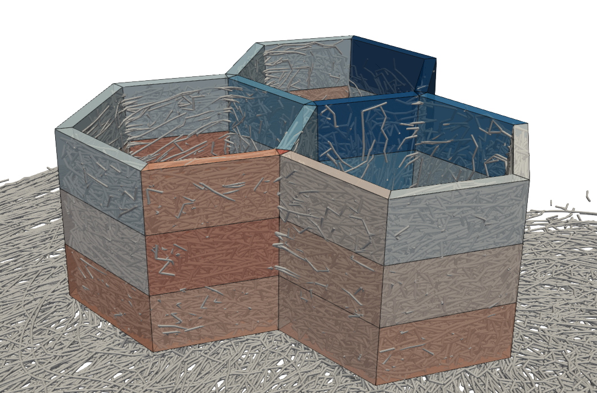
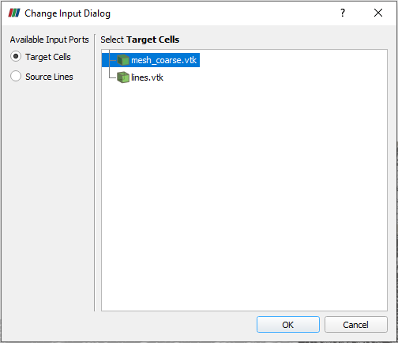
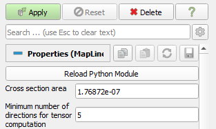

[](https://raw.github.com/nilsmeyerkit/fiberoripy/master/LICENSE)
[](https://github.com/psf/black)

# Paraview Map Lines
This repository offers a filter to evaluate results from direct simulation techniques [1, 2, 3, 4] on a volume mesh. The result is a solid volume mesh that contains the cell data attributes 'Orientation Tensor (2nd Order)', 'Orientation Tensor (4th Order)' and 'Volume Fraction'.

Essentially, the filter takes a mesh consisting of one-dimensional line elements (source) and a second mesh consisting of solid elements (target) as input. It evaluates the length and direction of the lines in each solid cell considering also partial overlaps. The data is then used to compute effective properties in the cell from the line-based microstructure.



### Requirements and installation
The plugin requires Paraview 5.8 or higher. Load the plugin to Paraview via `Tools` -> `Manage Plugins...` -> `Load New` and select the file `map_lines_filter.py`.

### Usage
Load a VTK file with line elements and a VTK file with cells to paraview. Execute `Filters` -> `Map Lines` to select source lines and target cells. 



Click `Okay` and set a cross section attributed to the line segments as well as a minimum number of lines required to compute a fiber orientation tensor. 

> Note: The definition of the tensor as description of the orientation field is only useful for a certain amount of fibers. Counting a single direction as fully oriented material is often undesired and defining it as unknown/NaN is probbaly more helpful.



Click `Apply` to start the plugin.

### Converters

The filter requires the lines to be in a VTK format. If the lines are output in an other format, a short converter script may be used to convert them to VTK format.  

#### Mechanistic
If line positions are given in a text file of the form
```
N
1 x1 y1 z1
1 x2 y2 z3
...
1 xN yN zN
M
1 x1 y1 z1
1 x2 y2 z3
...
1 xM yM zM
...
```
you may use 

        convert_mechanistic2vtk.py <infile>.txt
        
to create a VTK that can be used for the Paraview filter.

#### 3D TIMON 
If line positions are results of a 3D TIMON simulation, you may use 

        convert_3dtimon2vtk.py <filename>.unv 

to create a VTK that can be used for the Paraview filter.

### References
[1] Meyer et al., Direct Bundle Simulation approach for the compression molding process of Sheet Molding Compound, Composites Part A: Applied Science and Manufacturing, Volume 132,
2020,(https://doi.org/10.1016/j.compositesa.2020.105809).

[2] Londoño-Hurtado., Mechanistic Model for Fiber Flow; University of Wisconsin-Madison: Madison, WI, USA, 2009.

[3] Kuhn et al., 'A simulative overview on fiber predictions models for discontinuous long fiber composites.', Polymer Composites. 2020;41:73–81. (https://doi.org/10.1002/pc.25346)

[4] Rothenhäusler et al., 'Experimental and Numerical Analysis of SMC Compression Molding in Confined Regions : A Comparison of Simulation Approaches.', Journal of Composites Science. 2022; 6(3) (https://doi.org/10.3390/jcs6030068)
